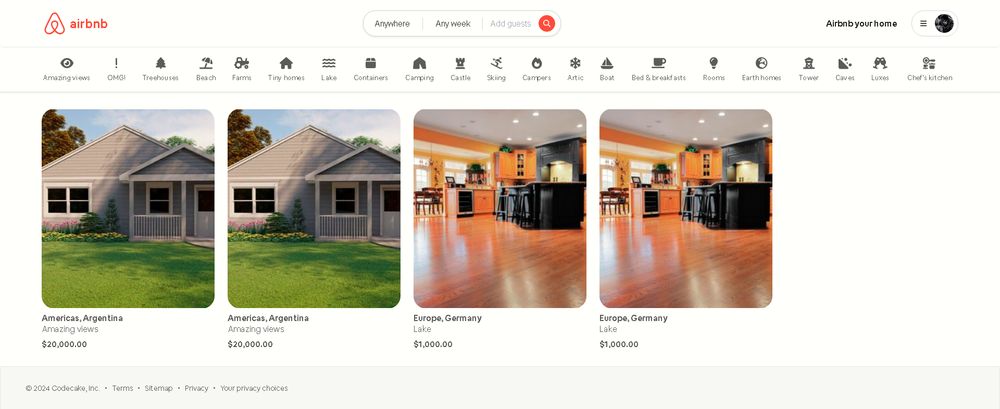

# Airbnb Clone - Backend

Este proyecto es el backend de un clon de **Airbnb**, desarrollado como parte de una aplicación Full Stack que utiliza **Spring Boot 3**, **PostgreSQL** como base de datos, y **Auth0** para autenticación y autorización (OAuth2). Este backend gestiona funcionalidades clave para la reserva y administración de alojamientos.




## Tabla de contenidos
- [Características clave](#características-clave)
- [Requisitos previos](#requisitos-previos)
- [Instalación](#instalación)
- [Uso](#uso)
- [Tecnologías utilizadas](#tecnologías-utilizadas)

---

## Características clave
- 📅 **Gestión de Reservas**: Reserva y gestión de propiedades para viajeros y propietarios.
- 🔍 **Búsqueda avanzada**: Filtrado por ubicación, fechas, número de huéspedes, camas, entre otros.
- 🔐 **Autenticación y autorización**: Integración de Auth0 para autenticación y gestión de roles.
- 🏢 **Domain-Driven Design**: Arquitectura basada en DDD para mejor escalabilidad y mantenimiento.

---

## Requisitos previos

Antes de empezar, asegúrate de contar con lo siguiente:
- **JDK 21**: [Descargar JDK 21](https://www.oracle.com/java/technologies/javase/jdk21-archive-downloads.html)
- **PostgreSQL**: [Descargar PostgreSQL](https://www.postgresql.org/download/)
- **IDE compatible** ([VSCode](https://code.visualstudio.com/download) o [IntelliJ](https://www.jetbrains.com/idea/download/))

---

## Instalación

1. Clona el repositorio del proyecto:
   ```bash
   git clone https://github.com/C0de-cake/airbnb-clone-back
   ```

2. Configura la base de datos en PostgreSQL y actualiza los detalles de conexión en `application.properties`.

---

## Uso

### Ejecutar con Maven
Utiliza el siguiente comando para ejecutar la aplicación desde la línea de comandos con Maven:
```bash
./mvnw spring-boot:run -Dspring-boot.run.arguments="--AUTH0_CLIENT_ID=<client-id> --AUTH0_CLIENT_SECRET=<client-secret>"
```

### Ejecutar en IntelliJ
1. Abre el proyecto en IntelliJ.
2. Agrega las variables de entorno `AUTH0_CLIENT_ID` y `AUTH0_CLIENT_SECRET` en la configuración de ejecución.
3. Ejecuta la aplicación desde IntelliJ.

---

## Tecnologías utilizadas
- **Backend**: Spring Boot 3
- **Base de datos**: PostgreSQL
- **Autenticación**: Auth0 (OAuth2)
- **Arquitectura**: Domain-Driven Design (DDD)

---

Este archivo `README.md` proporciona una guía clara para configurar y ejecutar el backend de tu proyecto Airbnb Clone. Asegúrate de reemplazar `<client-id>` y `<client-secret>` con tus credenciales de Auth0 al ejecutar la aplicación.
